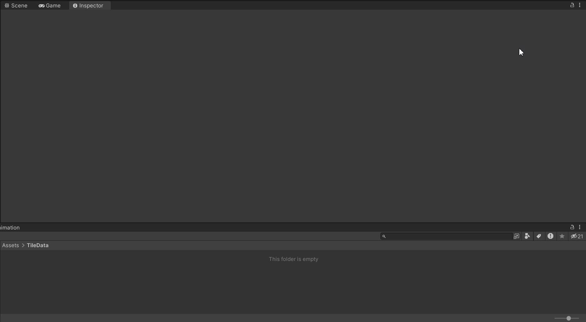
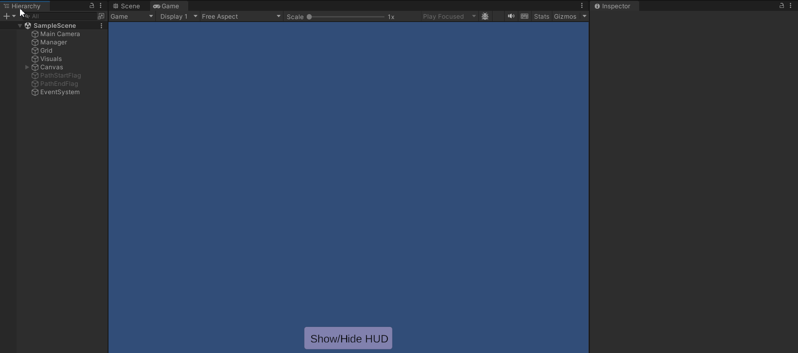
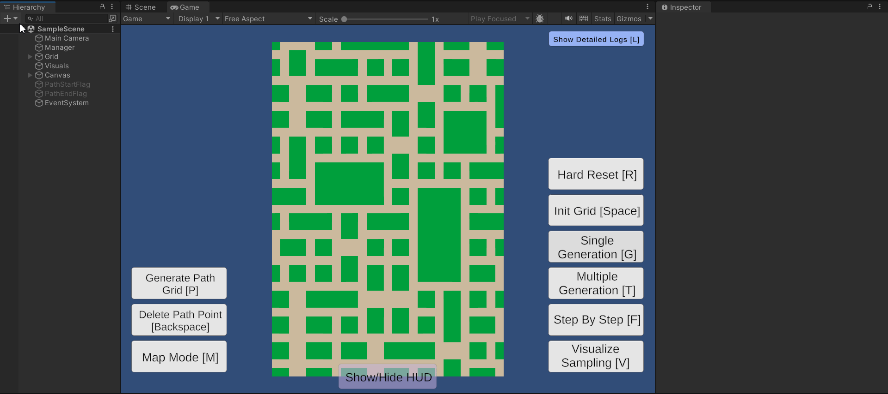
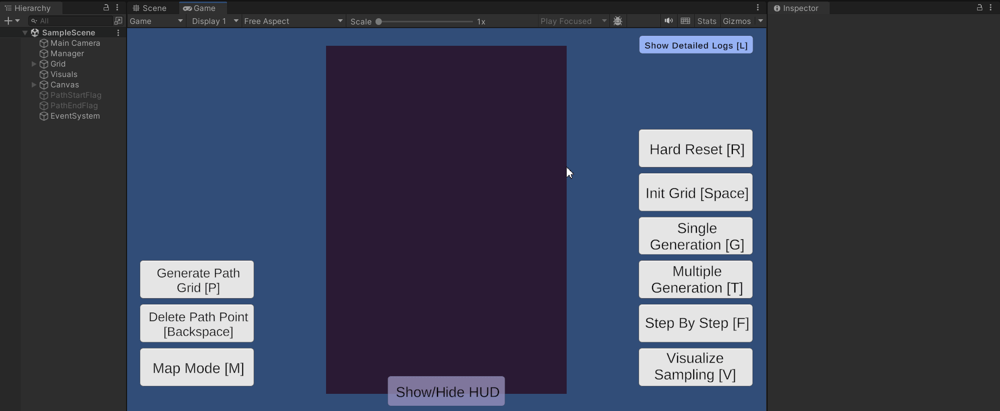
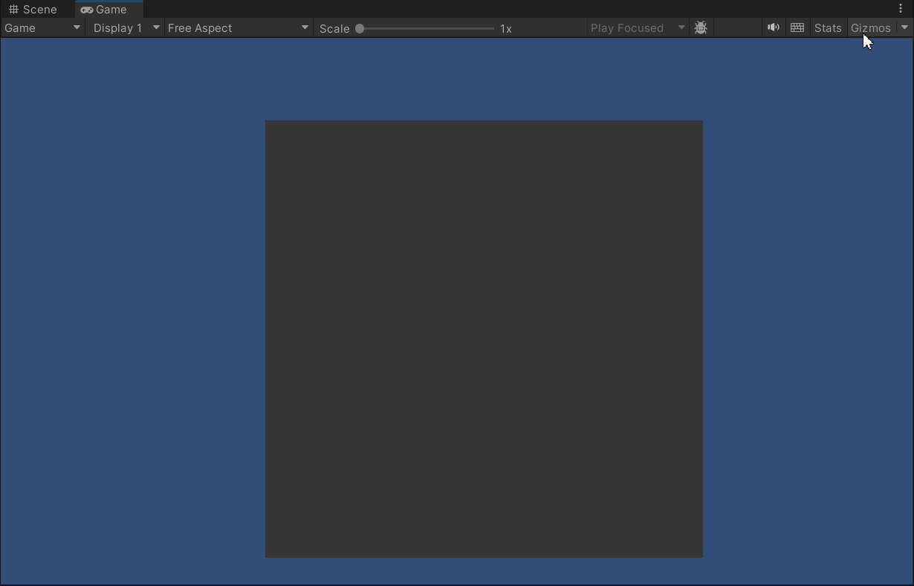

# 🧩 **Unity Procedural Map Generation & Pathfinding System**

A **Wave Function Collapse** (WFC) map generation system with a Custom-Heap **A\* Pathfinding** implementation. Tool that allows rapid prototyping of procedurally generated tile-based maps with built-in backtracking and navigation support.

### 🚀 Key Features
- **Wave Function Collapse (WFC)**: Generates rule-based maps from simple sprite sets.

- **Backtracking**: Ensures completion of generation.

- **A\* pathfinding**

- **Auto Tile Sampling**: Automatic processing of sprites to determine adjacency rules based on edge matching.

- **Visual Debugging**: Real-time visualization of tile entropy, walkable areas, and sampling points using Gizmos.

### 🛠 Setup & Workflow
**1. Data Preparation**
- Place your sprites into a dedicated folder.
- Create a **TileData Scriptable Object**.
- Assign your sprite folder to the TileData object.
- **Set Color Diversity**: Defines how many points along the edge are sampled for matching. *Use a low value for simple tiles and higher for complex transitions*.
- Click **Generate Tile Data** to process adjacency rules.

 

 

**2. Scene Configuration**
- Assign your **generated TileData** to the **ProceduralGenerationManager**.
- Set your desired **Grid Size** (Rows/Columns).

### 🎮 Controls & Interaction
**Map Generation**
| Key | Action | Description |
| :--- | :--- | :--- |
| **Space** | `Init Grid` | Initializes the empty grid structure. |
| **G** | `Single Gen` | Starts a single full map generation process. |
| **F** | `Step-by-Step`| Iterates generation one tile at a time for debugging. |
| **T** | `Multi-Test` | Runs $N$ consecutive test map generation cases. |
| **V** | `Visualize` | Overlays red markers on sprites to show sampling points. |

 

 

 
 

**Pathfinding & Navigation**
| Key | Action | Description |
| :--- | :--- | :--- |
| **P** | `Generate Path Grid`| Bakes the walkable grid based on defined "Walkable Color." |
| **M** | `Map Mode` | Enter selection mode. **Left Click** tiles to set waypoints. |
| **Backspace** | `Undo Point` | Removes the last selected waypoint. |

 

 

 
 

**System Utilities**
| Key | Action | Description |
| :--- | :--- | :--- |
| **L** | `Toggle Logs` | Enables/Disables detailed debugging logs. |
| **H** | `Toggle HUD` | Shows/Hides UI buttons. |
| **R** | `Reset` | Emergency scene reload. |

### 🔍 Technical Insights
**Walkable Grid Baking**
 By pressing **[P]**, the system evaluates the generated map. It checks the colors of the placed tiles against your "Walkable" settings to create a navigation mesh.
- **Gizmo View**: In the editor, green areas represent walkable nodes, and red areas represent obstacles.

 

 

**A\* Pathfinding**
 The pathfinding utilizes a **Min-Heap Priority Queue** for $O(1)$ retrieval of the lowest cost node. It supports: 
- **Multi-Point Routing**: Pathfind through an unlimited chain of waypoints.
- **Diagonal Toggle**: Switch between 4-direction or 
8-direction movement via Scriptable Object.

**Debugging & Gizmos**
  If **Gizmos** are enabled during generation:
- **Debugger**: Toggle detailed console logs with **[L]** to monitor backtracking events and generation logic.
- **Entropy View**: Left-click a tile during generation to see remaining possibilities for neighbors.

 

 

### 📦 Requirements
- Sprites must be set to **Read/Write Enabled** in Import Settings for sampling to work.
